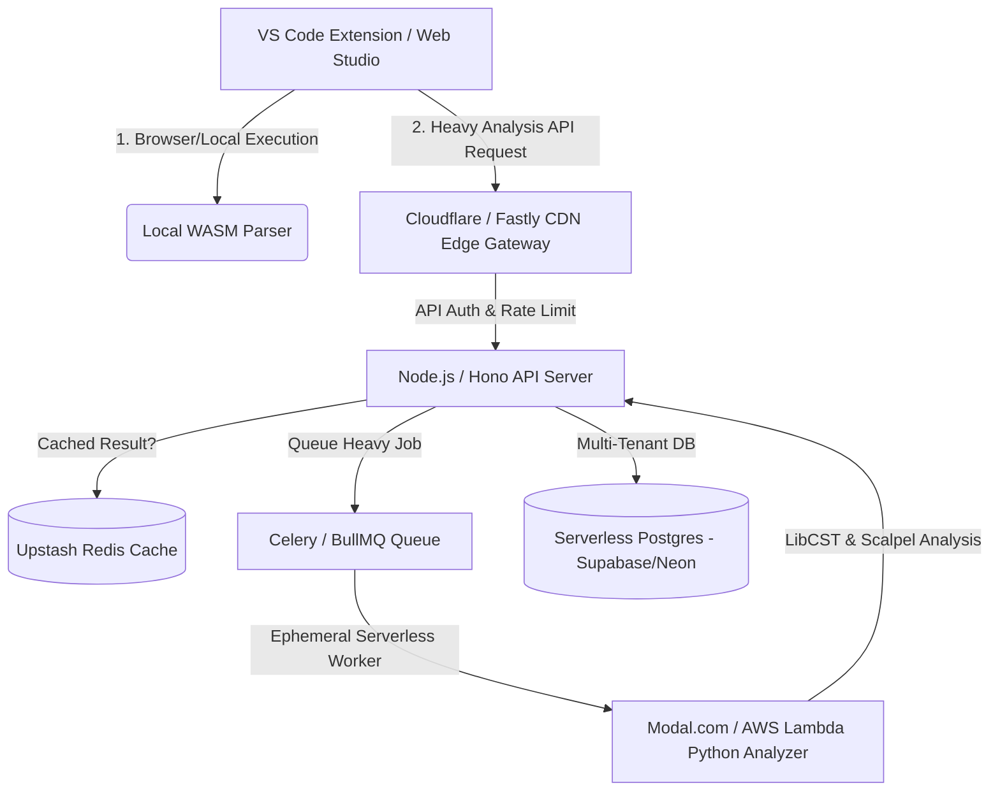

# CodeGate SaaS & Enterprise B2B Product Blueprint

## 1. Product & Monetization Strategy (B2B SaaS)

CodeGate targets software engineering teams, DevSecOps leads, and enterprise security administrators who need automated, path-sensitive static resource leak detection and auto-fix capabilities across their repositories.

### Pricing Tiers

```
┌─────────────────────────┐   ┌─────────────────────────┐   ┌─────────────────────────┐
│   DEVELOPER / STARTER   │   │       TEAM PLAN         │   │     ENTERPRISE B2B      │
│      $0 / month         │   │  $19 / dev / month      │   │  $49+ / dev / month     │
├─────────────────────────┤   ├─────────────────────────┤   ├─────────────────────────┤
│ • Web Studio (browser)  │   │ • Everything in Free    │   │ • Everything in Team    │
│ • VS Code Extension     │   │ • Cloud Org Dashboard   │   │ • Org Admin Portal      │
│ • 50 scans / month      │   │ • GitHub PR Bot         │   │ • SAML / SSO (Okta)     │
│ • Standard rules (files,│   │ • Shared Policy Rules   │   │ • Custom Policy Engine  │
│   sockets, DB handles)  │   │ • CI/CD Integration     │   │ • Audit Logs & Reports  │
│                         │   │ • 5,000 scans / month   │   │ • On-Prem / VPC Runners │
└─────────────────────────┘   └─────────────────────────┘   └─────────────────────────┘
```

---

## 2. Cost-Effective & Scalable System Architecture

To minimize hosting costs while scaling to thousands of concurrent developer scans:



### Cost Optimization Principles:

1. **Client-Side First Execution (WASM / Pyodide)**:
   - For basic syntax & AST scans, compile lightweight Python heuristics to WebAssembly / Pyodide.
   - **Cost impact**: 70%+ of simple scans execute directly in the developer's browser or IDE extension with **$0 server compute cost**.

2. **Serverless Ephemeral Analyzers (Scale to Zero)**:
   - Run heavy Scalpel CFG path evaluation and LibCST auto-fix generation inside containerized serverless runners (AWS Lambda, Modal.com, or Cloudflare Workers).
   - Compute resources scale down to zero when developers aren't running analyses.

3. **Content-Hash Result Caching**:
   - Cache code file SHA-256 hashes in Redis/Postgres. If code has not changed on a given commit/file, return cached trajectory and verdict instantaneously without re-executing Scalpel/LibCST.

---

## 3. Admin Organization Portal & Team Management

The Admin Organization Portal allows engineering managers and security team leads to provision seats, manage access, enforce security policies, and inspect organization-wide compliance.

```
┌─────────────────────────────────────────────────────────────────────────────┐
│ CodeGate Admin Portal                                 [Acme Corp - Enterprise]│
├─────────────────────────────────────────────────────────────────────────────┤
│  [Overview]  [Team Members]  [Repositories]  [Policy Engine]  [API Keys]     │
├─────────────────────────────────────────────────────────────────────────────┤
│                                                                             │
│  ORGANIZATION SECURITY OVERVIEW                                             │
│  ┌──────────────────┐  ┌──────────────────┐  ┌──────────────────┐           │
│  │ Active Developers│  │ Scanned Repos    │  │ Resource Leaks   │           │
│  │    48 / 50 seats │  │    32 repos      │  │ 14 Fixed (89%)   │           │
│  └──────────────────┘  └──────────────────┘  └──────────────────┘           │
│                                                                             │
│  POLICY ENFORCEMENT RULES                                                   │
│  [✓] Block PR merge on unclosed Socket / Database handles                   │
│  [✓] Require LibCST Auto-Fix previews on all Python PRs                     │
│  [ ] Enforce strict exception path verification (Ruff + CodeGate Ensemble)  │
│                                                                             │
│  TEAM MEMBERS & PERMISSIONS                                                 │
│  Name               Role        Status      Last Active    Actions          │
│  Sarah Connor       Admin       Active      2 mins ago     [Edit] [Revoke]  │
│  Alex Mercer        Developer   Active      1 hour ago     [Edit] [Revoke]  │
│  Devin Zhao         Tester      Invited     Pending        [Resend]         │
│                                                                             │
└─────────────────────────────────────────────────────────────────────────────┘
```

### Key Admin Portal Modules:

1. **Seat & License Management**:
   - Role-based Access Control (RBAC): `Org Admin`, `Security Lead`, `Developer`, `Auditor`.
   - Seat auto-provisioning via SAML / SCIM (Okta, Azure AD, Google Workspace).

2. **Organization Policy Engine**:
   - Admins define central compliance rules enforced across all developer IDEs and GitHub PR checks (e.g. *Require context managers for all SQL connections*).

3. **GitHub & CI/CD Pipeline Central Management**:
   - Single-click GitHub App installation across all organization repositories.
   - Central token key generation for CI/CD runners (GitHub Actions, GitLab CI, Jenkins).

4. **Compliance & Audit Exports**:
   - One-click PDF/CSV security export for SOC 2 Type II, ISO 27001, and OWASP code integrity audits.

---

## 4. Scalable Data Model (Multi-Tenant Schema)

```sql
-- Organizations / B2B Accounts
CREATE TABLE organizations (
    id UUID PRIMARY KEY DEFAULT gen_random_uuid(),
    name VARCHAR(255) NOT NULL,
    plan VARCHAR(50) DEFAULT 'team', -- 'free', 'team', 'enterprise'
    seat_limit INT DEFAULT 10,
    stripe_customer_id VARCHAR(255),
    created_at TIMESTAMP WITH TIME ZONE DEFAULT NOW()
);

-- Organization Members (Developers, Admins)
CREATE TABLE org_members (
    id UUID PRIMARY KEY DEFAULT gen_random_uuid(),
    org_id UUID REFERENCES organizations(id) ON DELETE CASCADE,
    user_id UUID NOT NULL,
    role VARCHAR(50) DEFAULT 'developer', -- 'admin', 'lead', 'developer', 'auditor'
    status VARCHAR(50) DEFAULT 'active',
    created_at TIMESTAMP WITH TIME ZONE DEFAULT NOW()
);

-- Repositories & CI Checks
CREATE TABLE repositories (
    id UUID PRIMARY KEY DEFAULT gen_random_uuid(),
    org_id UUID REFERENCES organizations(id) ON DELETE CASCADE,
    name VARCHAR(255) NOT NULL,
    provider VARCHAR(50) DEFAULT 'github',
    is_active BOOLEAN DEFAULT TRUE,
    created_at TIMESTAMP WITH TIME ZONE DEFAULT NOW()
);

-- Leak Scan Telemetry & Results
CREATE TABLE scan_reports (
    id UUID PRIMARY KEY DEFAULT gen_random_uuid(),
    org_id UUID REFERENCES organizations(id) ON DELETE CASCADE,
    repo_id UUID REFERENCES repositories(id),
    commit_sha VARCHAR(40),
    file_path TEXT NOT NULL,
    leak_count INT DEFAULT 0,
    acquires_count INT DEFAULT 0,
    analysis_ms FLOAT,
    verdict VARCHAR(50), -- 'CLEAN', 'LEAK_DETECTED'
    report_json JSONB,
    created_at TIMESTAMP WITH TIME ZONE DEFAULT NOW()
);
```

---

## 5. High-Value Roadmap & Revenue Features

1. **GitHub Pull Request Bot**:
   - Automatically inspects incoming PRs, highlights unclosed file/socket handles directly on the diff lines, and posts a **One-Click LibCST Auto-Fix suggestion**.

2. **IDE Real-Time Extension (VS Code & JetBrains)**:
   - Background inline squiggly underlines on leaking lines as developers type code locally.

3. **Enterprise VPC & Air-Gapped Deployments**:
   - For finance and healthcare customers with strict data privacy requirements, provide a Docker/Helm chart deployment that runs 100% inside their private cloud or Kubernetes cluster.
